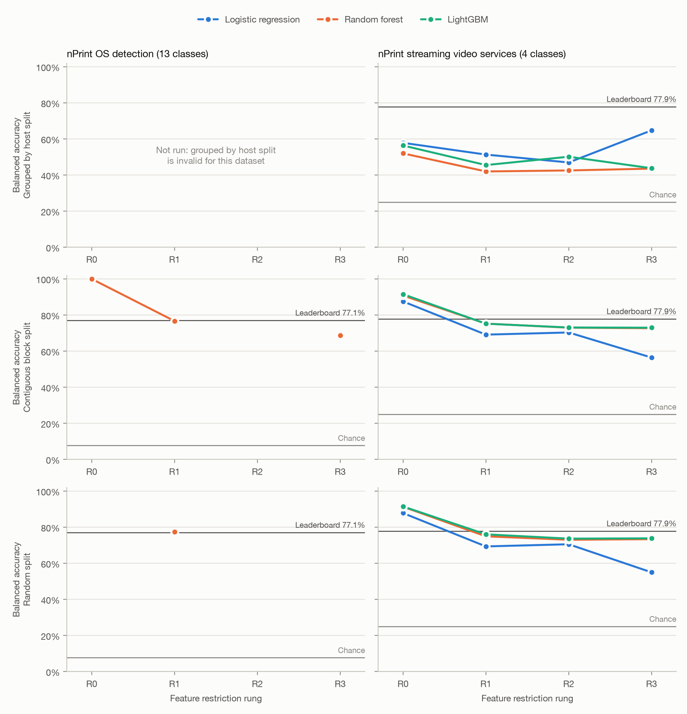

# netleak

**How much reported accuracy on traffic-classification benchmarks survives when a model
cannot see who sent the packets?**

Winston Li and Chris Furlong · CMSC 25422, Machine Learning for Computer Systems

Packet-level representations such as [nPrint](https://nprint.github.io/nprint/) expose every
header bit, including fields that identify the *host* rather than its *behaviour*: addresses,
ports, TCP sequence numbers. A classifier that keys on them scores well on a split drawn from
the same capture and fails on any other network. This repository measures the size of that
effect on two [pcapML benchmarks](https://nprint.github.io/benchmarks/), with one shared
pipeline, four feature-restriction rungs, three models and up to three kinds of train/test split.

## The restriction ladder

| Rung | Features | Removed relative to the rung above |
|---|---|---|
| **R0** unrestricted | all nPrint IPv4 + TCP bits (960 per packet) | nothing; deliberately illegal, the leakage ceiling |
| **R1** benchmark-legal | R0 minus the OS-detection benchmark's disallowed fields | IPv4 src/dst, TCP src/dst port, TCP seq/ack |
| **R2** behaviour only | R1 minus remaining identifier-like fields | IPv4 ID, IPv4 and TCP checksums; TCP timestamp-option values zeroed |
| **R3** cheap baseline | 12 hand features: TTL, TCP window, flags, options length, IP length (mean, std), inter-arrival time (median, IQR) | all nPrint bits |

The definitions live in one file, [`src/netleak/rungs.py`](src/netleak/rungs.py), and
[`tests/test_rungs.py`](tests/test_rungs.py) checks them, including a synthetic *canary*
whose label is carried only by the source port: R0 must classify it and R1 must not.

## Splits

| Split | Held out | What it controls for |
|---|---|---|
| `grouped` | whole hosts: no host in both train and test | recognising a host already seen in training |
| `block` | the last 20% of each class, in capture order | neighbouring, overlapping samples |
| `random` | a stratified 20% | nothing: the setting leaderboard numbers usually come from |

## Datasets

| | OS detection | Streaming video services |
|---|---|---|
| Task | sending host's OS, 13 classes | video service, 4 classes |
| Samples | 12,439 × 100 packets | 20,884 × first 10 SYN/SYN-ACK packets |
| Leaderboard (AutoGluon, balanced accuracy) | 77.1% | 77.9% |
| Hosts | **13, one per class** | 13 clients, 12 of them in several classes |
| Splits run | `block`, `random` | `grouped`, `block`, `random` |
| Owner | Chris | Winston |

Two properties of the data shape the design, and both are findings in their own right:

- **Host grouping is impossible for OS detection.** Every OS was captured from exactly one
  source IP, so a host-grouped split holds out whole classes. The harness refuses such a split
  instead of reporting a meaningless number. Whether a model has learned "Windows 10" or "the
  machine at that address" cannot be separated on this benchmark.
- **Absolute timestamps are unusable** in both releases (years in the hundreds of thousands, and
  2^32-microsecond jumps in about half of all samples). Only in-sample packet order is reliable, so
  inter-arrival time uses robust statistics and no split is based on time.

## Quick start

Requires Python 3.10-3.12 and ~3 GB of disk.

```bash
git clone <repo-url> netleak && cd netleak
make setup            # .venv + pip install -e ".[dev]"
make test             # unit tests and leakage invariants, ~30 s, no data needed
.venv/bin/netleak smoke   # whole pipeline on synthetic data, < 1 min
```

## Reproducing the results

```bash
make all
```

This downloads both datasets (Google Drive, ~175 MB compressed), extracts features (~30 s),
runs every rung × model × split cell, computes field importance at R1 and renders the figures.
Cells that already have up-to-date results are skipped, so re-running is cheap. Each step is also
available on its own:

```bash
.venv/bin/netleak inspect  -d os_detection      # class balance, hosts per class, feature size
.venv/bin/netleak run      -d video_services --rung R2 --model rf --split grouped
.venv/bin/netleak --help
```

Or open `notebooks/01_os_detection.ipynb` / `notebooks/02_video_services.ipynb` and choose
*Restart kernel and run all*.

Outputs:

- `results/<dataset>/<rung>_<model>_<split>_p<packets>_s<seed>.json`: one file per cell, with
  balanced accuracy, macro-F1, confusion matrix, timings, and the code and rung versions used
- `results/summary.csv`: balanced accuracy for every cell
- `results/figures/headline.png`: balanced accuracy against rung, per dataset and split
- `results/figures/cost.png`, `confusion_<dataset>.png`, `importance_<dataset>_*.png`

## Results



Balanced accuracy, from `results/summary.csv`. The leaderboard reference is AutoGluon on the
benchmark-legal features (R1-equivalent).

**Streaming video services** (full grid; leaderboard 77.9%, chance 25%)

| Split | Rung | Logistic regression | Random forest | LightGBM |
|---|---|---|---|---|
| random | R0 | 87.8% | 91.3% | 91.5% |
| random | R1 | 69.4% | 74.9% | 76.0% |
| random | R2 | 70.5% | 73.0% | 73.7% |
| random | R3 | 55.0% | 73.4% | 73.8% |
| block | R0 | 87.5% | 90.8% | 91.5% |
| block | R1 | 69.1% | 75.2% | 75.2% |
| block | R2 | 70.3% | 73.0% | 73.1% |
| block | R3 | 56.4% | 72.7% | 73.0% |
| grouped by host | R0 | 57.8% | 52.0% | 56.4% |
| grouped by host | R1 | 51.3% | 42.0% | 45.5% |
| grouped by host | R2 | 47.0% | 42.5% | 50.1% |
| grouped by host | R3 | 64.8% | 43.6% | 43.8% |

**OS detection** (random-forest validation cells only; leaderboard 77.1%, chance 7.7%)

| Split | R0 | R1 | R2 | R3 |
|---|---|---|---|---|
| block | 100.0% | 76.7% | – | 68.8% |
| random | – | 77.4% | – | – |

The full OS grid (logistic regression and LightGBM, all rungs) takes about 4–5 hours on an M1
Pro and has not been run yet: `netleak grid -d os_detection`.

What the numbers so far show:

- **Identifier fields are worth ~15 points on video and ~23 on OS.** R0 → R1 costs video
  15 points (LightGBM, random split). On OS the source address alone gives a perfect score,
  because every class is one host.
- **The benchmark-legal rung reproduces the leaderboard** with untuned models: 76.0% vs 77.9%
  on video and 77.4% vs 77.1% on OS.
- **Twelve hand-picked header features match all 2,409 R2 bits** on video (73.8% vs 73.7%,
  LightGBM, random split) and come within ~8 points of R1 on OS, at a small fraction of the
  training cost.
- **Host grouping is the dominant effect on video.** Holding out whole client hosts drops every
  model and rung to 42–65%, well below the leaderboard, even at R0. What the benchmark rewards is
  largely recognising capture conditions, not service behaviour. Grouped numbers rest on 13
  hosts, so they are noisy.
- On video at R1, field importance (grouped split) is led by TCP options, TTL and **IP ID**. IP ID
  is an identifier-like field that R2 removes.

## Repository layout

```
src/netleak/    the harness: datasets, load, encode, features, rungs, splits, models,
                results, runner, importance, plots, cli (module map in AGENTS.md)
tests/          encoder vs scapy, leakage invariants, splits, end-to-end smoke
notebooks/      one notebook per dataset: thin callers of netleak.runner
results/        committed result JSON, summary table and figures
data/, cache/   downloaded pcapML files and feature caches (gitignored)
```

## Working on the code

[AGENTS.md](AGENTS.md) is the contributor guide, for people and coding agents alike. It covers
the commands, the invariants that keep results comparable, the recipes for adding a dataset,
model, rung or figure, and who owns what.

## Data and references

- nPrint OS detection and streaming video services datasets, from the
  [pcapML benchmarks](https://nprint.github.io/benchmarks/).
- J. Holland, P. Schmitt, N. Feamster, P. Mittal. *New Directions in Automated Traffic Analysis.*
  CCS 2021. (nPrint)
- F. Bronzino et al. *Inferring Streaming Video Quality from Encrypted Traffic.* 2019. (source
  of the video sessions)
- [`pcapml`](https://pypi.org/project/pcapml/) for reading pcapML files.

## Acknowledgements

The harness was built with help from Claude Code (Anthropic) in planning, implementing and
testing. The experimental design, interpretation and report are the authors'.
